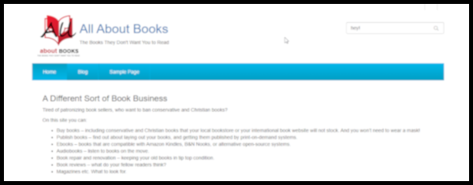

# OCWS Bookstore Instructions

## Read Me File
The READ ME file can be found at [./README.md]()

## Installation
This is an independent theme. Its code is held at Github. ([https://github.com/pftaylor61/bookstore](https://github.com/pftaylor61/bookstore)). Download a zip file of the theme. In your WordPress or ClassicPress installation, use Appearance > Themes > Add New > Upload Themes to locate the zip file and upload it. Click on the option to activate the theme.

## Bookstore Site Structure
Bookstore works best if a special Home page is created and set as a static page in Settings > Reading

# Logo
The logo can be changed using the Customization system.